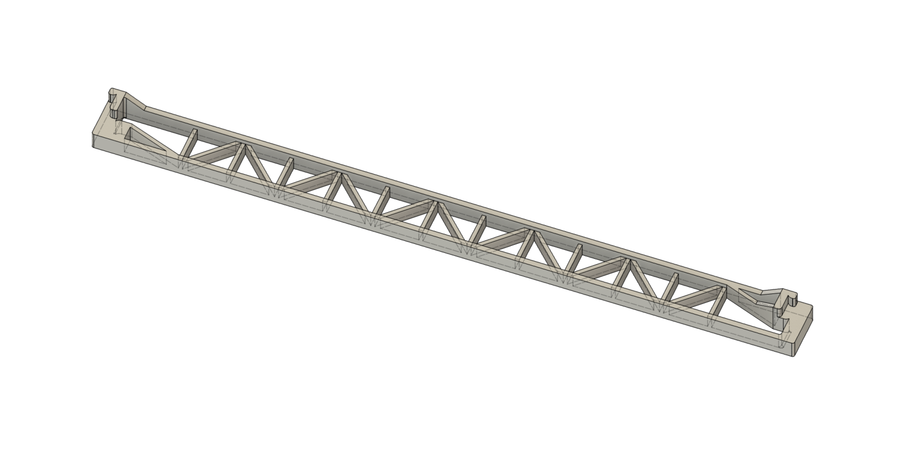
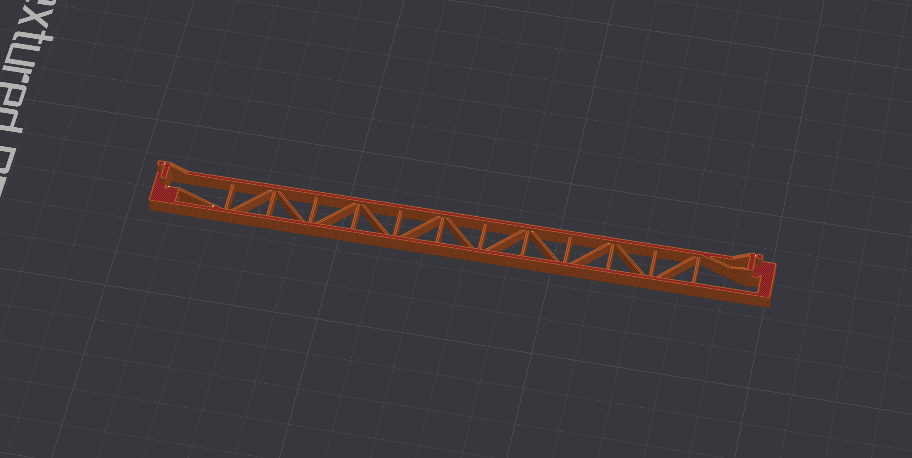
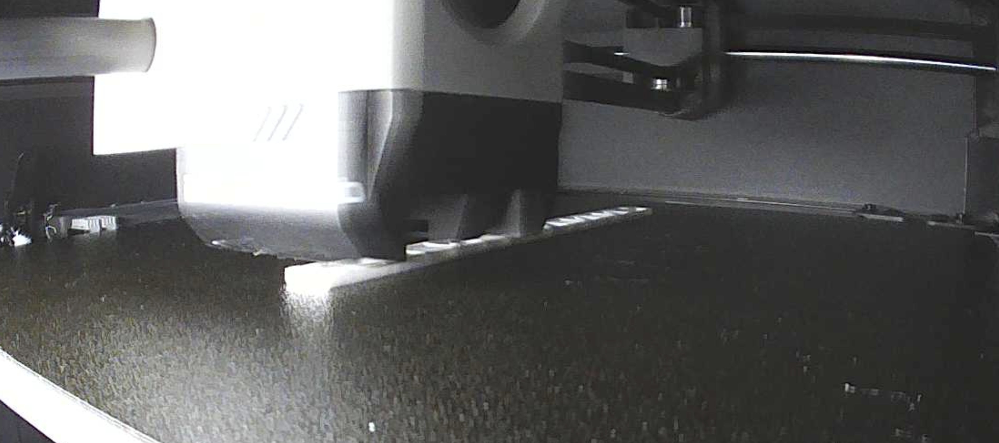
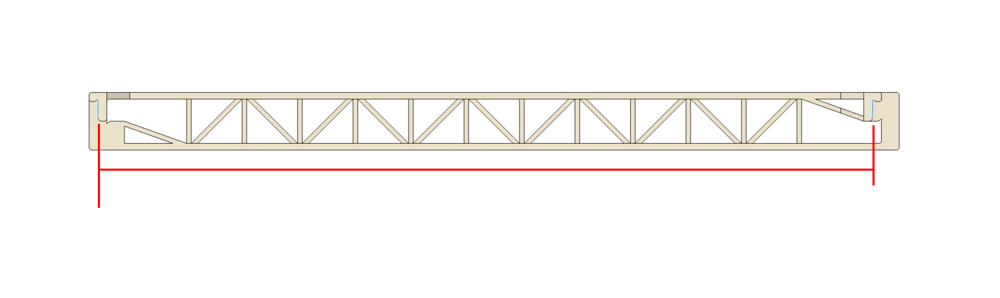
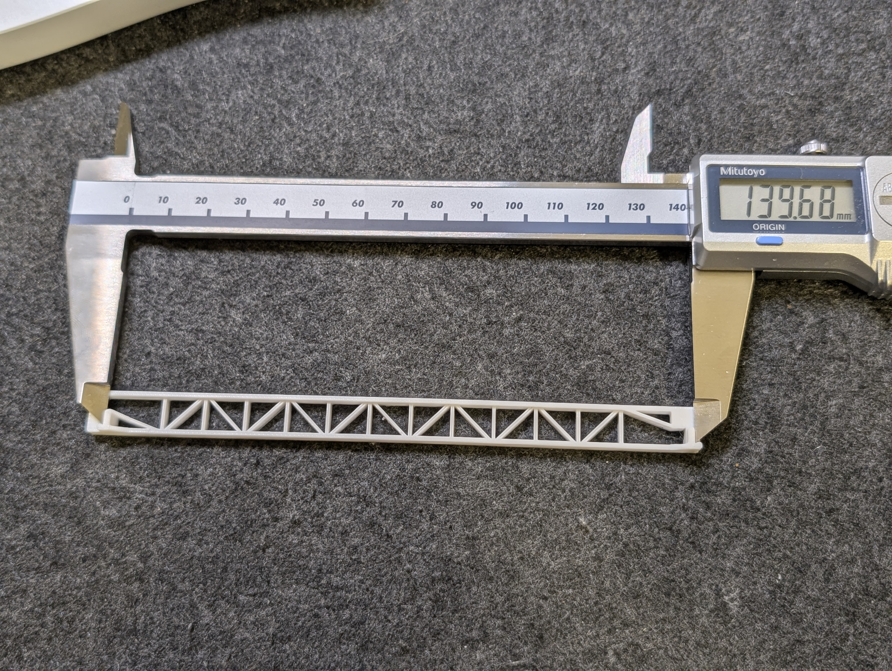
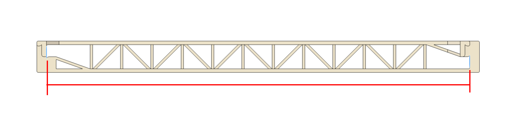
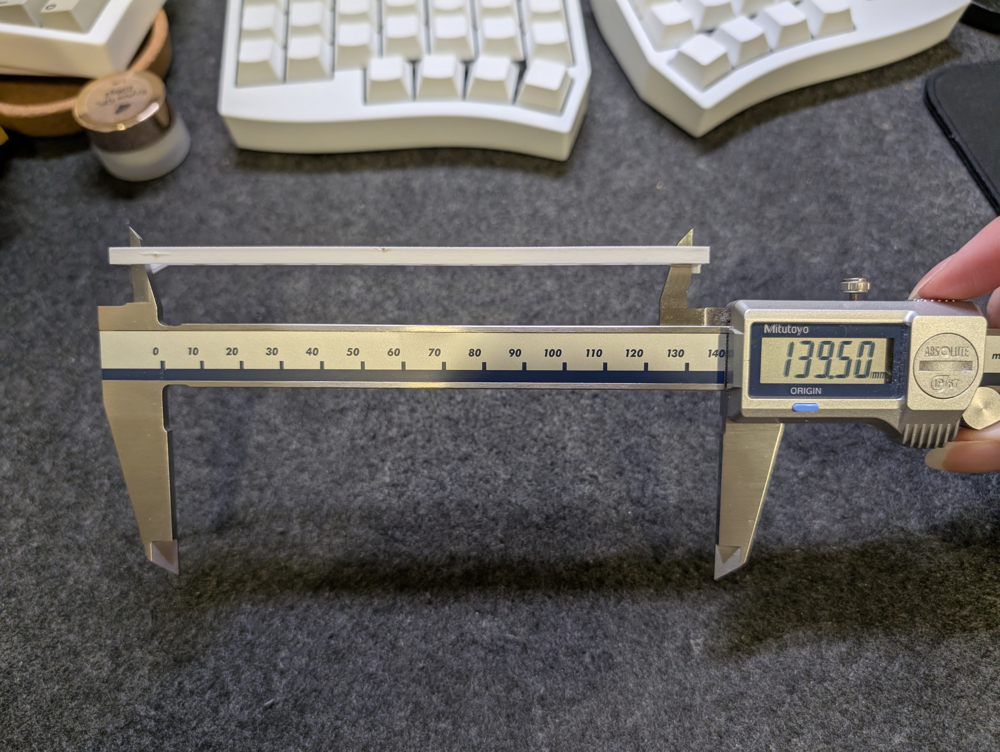

# Step 2 - Calibrating filament shrinkage quickly using the Single design

1. Make sure your filament has undergone prerequisite calibration:  
    1. Temperature settings  
    Personally I find that using the manufacturer's recommended settings is usually enough; the subsequent calibrations will usually make evident any issues.  
    If printing a temperature tower, breaking it to determine layer adhesion is strongly recommended.  
    1. Pressure Advance/Flow Dynamics  
    This can be done from Orca's built in calibration utilities (File -> New project, then Calibration -> Pressure advance) or from Bambu Studio's calibration page (Calibration -> Flow dynamics).  
    Make sure the chosen setting is applied properly to the printer (for example, Bambus may need selecting the K value from Device -> Filament, Klipper may need a per-filament startup macro for assigning the value).  
    1. Flow rate  
    This can also be done from Orca's built in calibration utilities (File -> New project, then Calibration -> Flow rate) or from Bambu Studio's calibration page (Calibration -> Flow rate).  
    I personally recommend using Orca's built-in "YOLO single-pass" for this calibration.  
    If using Bambu Studio's built-in flow rate calibration, make sure to select the *higher value* if torn between two chips on the first pass - the second pass only tests values under the first.  

2. Download the Single STL file from [here](/Truss%20Calibration%20Beam%20Single.stl).
    
3. Load it into a modern slicer of your preference, and slice it as described in the [Quad guide](./1-Quad-Calibration.md).
    Make sure that no seams exist on the measurement faces.  
    
4. Print the file.
    
5. Once printed, **do not force the print off the build plate** - this may warp the print and render measurements meaningless.  
  Wait for the print to fully cool, then remove it from the build plate; do not measure the print while it is attached to a build plate.  
6. Measure the X dimensions.  
  
    Before measuring, please note the following two warnings:
    1. **Do not apply excess force to the print with your calipers.**  
      The Truss is designed to resist such abuse as much as possible, but 3D printed plastics are elastic - applying excess force will deform the print and yield dimensions larger or smaller than actually printed.  
      Ideally the calipers should be exerting no expansive/compressive force on the print whatsoever - I personally let go of the clamping side entirely to achieve this, letting the print push the calipers back if necessary.  
      If your calipers have thumb-wheel rollers, do not use them to exert excess force during measurement.  
    
    2. Measure with the calipers parallel to the dimension you are measuring - excessively angled calipers will fail to measure the dimension correctly.

    Measure the following dimensions across the X beam:
    - Across these two walls using the outer measurement teeth of your calipers  
      
      
    - Within these two walls using the inner measurement teeth of your calipers  
      
      
      **Warning:** The file is designed to guide your calipers' inner teeth as accurately as possible, but only when oriented correctly.  
      View the below examples before measuring - **measuring incorrectly will yield incorrect, meaningless values.**  
      The photos are for the quad design, but apply to all variants equally.  

      **Correct:** 
      - The caliper enters from the top of the print  
      

      - The flat inner sides of the caliper are flush against the supportive walls of the print located halfway across the beam  
      
      
      - The above is true for both ends of the caliper  
      

  
      **Incorrect:**
      - The calipers' inner flat sides are not making contact against the supportive walls - this will yield a diagonal measurement longer than what is printed
      

      - The calipers are being used from the bottom of the print - the slanted diagonal/outer sides of the caliper teeth should never face the supportive walls in the middle
      

    Note these two values down - on a text editor or whatnot if manually calibrating, into the webapp once it goes live in the future.  

7. If calibrating manually, do the following:
    1. Take an average of the inner and outer values - add them up, divide by 2.  
    2. Multiply this value by the 4-axis extrapolation factor for the printer which you calculated at the end of Quad calibration.  
        The resulting value is the predicted/extrapolated average of a quad-beam print.  
    3. Divide the average value (either the extrapolated value ) by 140 (the designed length in millimeters of the beams). The resulting value (say somewhere in the 0.95~0.99 range) is the shrinkage value of the filament.  
    4. Use this value to adjust the filament's X/Y shrinkage compensation.  
        For Orca/Bambu, edit the filament's settings, and locate the XY shrinkage option.  
          
        Then, multiply the existing value by the obtained shrinkage value.  
        Say the obtained shrinkage value was 0.987 - in this case the existing value is 100%, so 100% * 0.987 would be 98.7%.  
          
