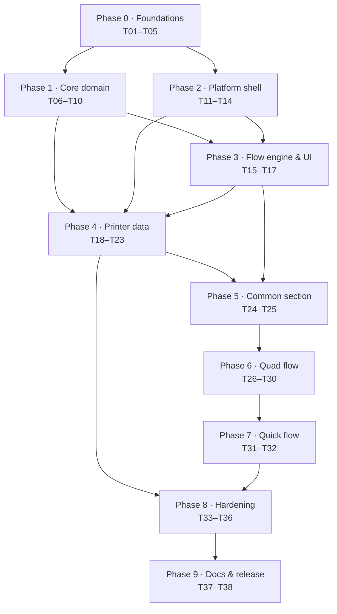

# Build Plan — Truss Calibrator Webapp

Derived from `ai-context/PRD.md` (Draft v0.1). Task IDs are stable references; use them in branches, PRs, and commits.

- **38 tasks** across 10 phases. Every task is one focused work session or less.
- Every task lists **Depends on** (prerequisites) and **Unblocks** (dependents) — no orphans: the only root is T01, and every other task has at least one prerequisite and at least one dependent.
- **Working agreement:** PRD is the source of truth. If implementation reveals a PRD decision is wrong, update the PRD in the same PR, never silently diverge. Pure logic (math, storage, import/export) is test-first. A task is done when its tests pass, `typecheck` + `build` are green, and any PRD open item it closes is recorded in the PRD.

**Size legend:** S ≈ under an hour · M ≈ half a day · L ≈ a full day. No task is larger than L.

---

## Phase overview

**Parallel lanes after T01–T03** (three independent tracks, if more than one person is available):

| Lane | Tasks | Notes |
|---|---|---|
| A — Pure logic | T04 → T05 → T06 | No DOM; highest correctness value; do this first even solo. |
| B — Persistence | T04 → T07 → T08 → T09/T10 | Depends on Lane A only for shared types (T04). |
| C — Platform | T11, T12 → T13 → T14 | Asset pipeline is independent of all logic. |

**Critical path (15 tasks):** T01 → T02 → T05 → T06 → T15 → T24 → T25 → T26 → T27 → T28 → T30 → T32 → T33 → T34 → T38

---

## Phase 0 — Foundations

### T01 — Repair the scaffold and establish the tooling baseline
**Size:** S · **Depends on:** — (root) · **Unblocks:** T02, T03, T11, T37

**Context:** The scaffold is broken as committed: `src/index.tsx` imports `./index.css`, which does not exist (`src/styles/global.css` does), and `App.tsx` renders nothing. `index.html` still carries Vite defaults. Every later task assumes a working dev loop and a known set of scripts, so this lands first.

**Subtasks**
- [ ] T01.1 Fix the entry stylesheet import; verify `pnpm dev` renders with no console errors
- [ ] T01.2 Verify `pnpm build` and `pnpm preview` succeed; resolve any `tsconfig`/type errors that surface
- [ ] T01.3 Update `index.html` (title, `lang`, meta) and settle its role as the **dev harness page** — it is not shipped UI
- [ ] T01.4 Add scripts: `typecheck`, `test`, `test:coverage`, `lint`, `format`, `assets:sync`
- [ ] T01.5 Add minimal ESLint (flat config, TS + Solid) and Prettier — configuration only, no plugin sprawl
- [ ] T01.6 Pin and document the Node/pnpm versions used

---

### T02 — Test infrastructure
**Size:** M · **Depends on:** T01 · **Unblocks:** T05, T07, T10

**Context:** PRD §14 defines success as numeric parity with the documented manual procedure via hand-computed fixtures, so the test runner is not optional scaffolding — it is the acceptance mechanism. Vitest reuses the existing Vite config, which keeps the setup small.

**Subtasks**
- [ ] T02.1 Install and configure Vitest against the existing Vite config; add a jsdom environment
- [ ] T02.2 Add `@solidjs/testing-library` plus one smoke test proving component tests run
- [ ] T02.3 Configure coverage output and a threshold gate
- [ ] T02.4 Establish the convention: tests co-located as `*.test.ts(x)`
- [ ] T02.5 Add a CI workflow (typecheck + test + build) on push and PR

---

### T03 — Close the blocking open items
**Size:** M · **Depends on:** T01 · **Unblocks:** T04, T05, T07, T11

**Context:** Four PRD open items block code. Two are effectively permanent: §13.7 storage key names (renaming after ship orphans stored user data) and §13.1 final percentage precision (it is the number users retype into a slicer). §13.2 gates validation and §13.3 gates the asset pipeline. The remaining open items (§13.4–§13.6) are closed inside the tasks that own those screens: T17, T18, T21, T22.

**Subtasks**
- [ ] T03.1 Decide final percentage precision (§13.1) — inspect the Orca/Bambu XY shrinkage field's accepted precision; record the choice and rationale in PRD §8.2
- [ ] T03.2 Finalize storage key names and versioning scheme (§13.7); record in PRD §7
- [ ] T03.3 Decide the inner/outer divergence warning threshold (§13.2); record in PRD §8.3
- [ ] T03.4 Decide image optimization targets (§13.3): display dimensions, output format, 1x/2x policy
- [ ] T03.5 Mark these resolved in PRD §13

---

### T04 — Project structure and domain types
**Size:** M · **Depends on:** T01, T03 · **Unblocks:** T05, T07, T12, T15

**Context:** One place to define the app's vocabulary so the math, storage, and UI layers cannot drift — in particular the single shared `CalibrationDraft` (PRD §9.3, decision 2) and the printer record whose identity is its name (PRD §7, decision 5). Types should encode PRD invariants rather than restating them in prose.

**Subtasks**
- [ ] T04.1 Create the directory layout: `src/domain`, `src/storage`, `src/flow`, `src/components`, `src/element`, `src/assets`
- [ ] T04.2 Define `PrinterRecord`, `SettingsState`, and the versioned payload envelopes from PRD §7
- [ ] T04.3 Define `CalibrationDraft` covering both quad (8 values) and single (2 values) variants
- [ ] T04.4 Define step IDs, flow IDs, and the step gating/exit-contract types
- [ ] T04.5 Define a shared result type for operations that can fail (storage, import) so failures are never thrown past the UI layer

---

### T05 — Rounding and number formatting utilities
**Size:** M · **Depends on:** T04, T03, T02 · **Unblocks:** T06, T16, T29

**Context:** PRD §8.2 mandates **round half-up**, deliberately departing from the outline's truncation. Note `toFixed` is not a correct implementation of round-half-up (binary representation makes cases like `1.005` and `0.981875` behave inconsistently), so this needs explicit exponent-based scaling. Display output must never be fed back into computation.

**Subtasks**
- [ ] T05.1 Implement `roundHalfUp(value, places)` with integer/exponent scaling — not `toFixed`
- [ ] T05.2 Add formatters for factor (10dp), ratio (5dp), and percentage (precision from T03.1)
- [ ] T05.3 Implement a numeric parser accepting comma or point decimals and rejecting partial or garbage input
- [ ] T05.4 Tests covering tie cases (`0.981875` → `0.98188`), the `1.005` float trap, zero, negatives, `NaN`, `Infinity`, and extreme magnitudes

---

## Phase 1 — Core domain logic

### T06 — Math engine (canonical, unified)
**Size:** L · **Depends on:** T05 · **Unblocks:** T15, T27, T28, T29

**Context:** PRD §8.1 is the heart of the product: both flows are **one** formula, $R = F \times (\text{basis}/140)$. The quad flow computes $F$ from 8 measurements and uses its own X average as the basis; the single flow uses the stored $F$ and the 2 measurements. Because multiplication commutes, the guides' two different phrasings are algebraically identical — the PRD requires one canonical evaluation order so the flows cannot diverge.

**Subtasks**
- [ ] T06.1 Implement `average(values)`, `quadBasis(draft)`, `quadFactor(draft)`, `quadRatio(draft)`
- [ ] T06.2 Implement `singleExtrapolatedAverage(measurements, factor)` and `singleRatio(...)` using the same canonical order
- [ ] T06.3 Implement `applyCurrentSlicerValue(currentPercent, ratio)` at full precision
- [ ] T06.4 Encode Fixtures A, B and C (PRD §14.1) as tests, with expected values hand-computed and the derivation written in comments
- [ ] T06.5 Add a property test generalizing Fixture C: single flow must reproduce the quad result whenever its basis equals that calibration's X average
- [ ] T06.6 Expose full-precision and display-rounded values from one entry point, so callers cannot accidentally compute from rounded data

---

### T07 — Storage adapter
**Size:** L · **Depends on:** T04, T03, T02 · **Unblocks:** T08, T09, T28, T33

**Context:** PRD §12 treats storage as unreliable by default. `localStorage` access can **throw** rather than return null (private browsing, disabled site data, restricted embedded contexts), writes can fail, and a corrupt payload must be preserved for export rather than overwritten — because the existing-wins import rule (decision 6) means re-importing cannot restore it.

**Subtasks**
- [ ] T07.1 Implement capability detection that probes availability without throwing
- [ ] T07.2 Implement typed read/write for the versioned envelopes with schema-version checks
- [ ] T07.3 Implement the in-memory fallback plus reactive degraded-mode state for the banner
- [ ] T07.4 Implement corrupt-payload handling: treat as empty, retain the raw string for export, never overwrite silently
- [ ] T07.5 Handle quota-exceeded write failures through the same degraded-mode path
- [ ] T07.6 Tests with a mock storage that throws, returns junk, and rejects writes

---

### T08 — Printer repository
**Size:** L · **Depends on:** T07 · **Unblocks:** T10, T18, T25, T28, T31

**Context:** Printers are the only persisted entity, identified by a unique trimmed case-insensitive name (PRD §7, decision 5). Centralizing CRUD, uniqueness enforcement, and record validation here means the UI never re-implements a rule — and the collision error type is what the mandatory save gate uses to present its recovery copy.

**Subtasks**
- [ ] T08.1 Implement `list`, `getByName`, `exists(name)`, `add`, `update`, `remove`
- [ ] T08.2 Implement name normalization and validation: trim, non-empty, unique case-insensitively
- [ ] T08.3 Implement factor validation (finite, positive)
- [ ] T08.4 Implement alphabetical case-insensitive sort as the canonical list order
- [ ] T08.5 Return a typed name-collision error rather than throwing
- [ ] T08.6 Tests covering CRUD, duplicate detection across case/whitespace, invalid factors, and degraded storage

---

### T09 — Settings store
**Size:** S · **Depends on:** T07 · **Unblocks:** T22, T24

**Context:** PRD §9.2 — a single global `skipPrerequisites` flag, persisted, reset only from the printer-data screen (decision 4). It must share the storage adapter's degraded-mode semantics: the flag must never *appear* set if it could not actually persist, or the prerequisite step would silently vanish for the session.

**Subtasks**
- [ ] T09.1 Implement read/write of `skipPrerequisites` through the storage adapter
- [ ] T09.2 Implement reset, consumed by the printer-data screen
- [ ] T09.3 Tests including degraded storage

---

### T10 — Import/export serialization and merge
**Size:** L · **Depends on:** T08, T02 · **Unblocks:** T23, T33

**Context:** PRD §11.1–§11.3 — versioned JSON array of records, **full-precision numbers in the file** (writing display-rounded values would silently degrade stored factors on every round trip), merge by name with existing-always-wins, and all-or-nothing validation: a half-applied import is worse than a refused one.

**Subtasks**
- [ ] T10.1 Implement the serializer producing the PRD's exact shape and the `truss-printers-YYYY-MM-DD.json` filename
- [ ] T10.2 Guarantee full-precision numeric output — no display rounding may leak into the file
- [ ] T10.3 Implement strict validation: JSON syntax, envelope shape, supported version, per-record name/factor validity
- [ ] T10.4 Implement the merge: add-only, skip conflicts, return added count and skipped names
- [ ] T10.5 Tests: export→import round trip is a no-op, conflicts skipped, every refusal reason distinct, duplicate names within one file, empty file, oversized file

---

## Phase 2 — Platform shell

### T11 — Asset pipeline
**Size:** M · **Depends on:** T01, T03 · **Unblocks:** T26, T31, T36

**Context:** PRD §6.3 — the three STLs at repo root are the source of truth and are copied at build time into gitignored app assets, so they cannot drift. Images from `Documentation/Images` (38MB, 31 files, 28 referenced, up to 2.7MB each) are resized per T03.4. The load-bearing constraint: URLs must resolve against the app's **own script URL**, never the page or domain root, or zero-config embedding under a sub-path breaks.

**Subtasks**
- [ ] T11.1 Write `scripts/sync-assets` to optimize and copy the referenced images and copy the two used STLs (Quad, Single — not Dual) into the app's static assets
- [ ] T11.2 Wire it as `predev`/`prebuild`; add generated paths to `.gitignore`
- [ ] T11.3 Implement one shared asset-URL resolver used everywhere (`import.meta.url`-based; no root-absolute paths)
- [ ] T11.4 Add a build test asserting emitted URLs are base-relative and resolve under a simulated sub-path
- [ ] T11.5 Document the regeneration step in the app README stub

---

### T12 — Custom element shell
**Size:** M · **Depends on:** T04 · **Unblocks:** T13, T14

**Context:** PRD §6.1–§6.2, decisions 13–14 — `<truss-calibrator>` with a shadow root, **zero configuration**: no attributes, no events, no imperative API, and no routing of any kind. It must clean up on disconnect (a host page may mount and unmount it freely) and keep the existing `index.html` usable as a development harness.

**Subtasks**
- [ ] T12.1 Implement the element class: `attachShadow`, render a Solid root into it, dispose the root in `disconnectedCallback`
- [ ] T12.2 Configure the library build (`vite build --lib`) emitting the JS + CSS the host page includes
- [ ] T12.3 Repoint the dev harness to mount the element rather than `App` directly
- [ ] T12.4 Set `delegatesFocus` and verify tab order into and through the widget
- [ ] T12.5 Verify by grep/test that nothing in the app touches `location`, `history`, or deep links

---

### T13 — Shadow-root styling foundation
**Size:** M · **Depends on:** T12 · **Unblocks:** T14, T15, T16, T17

**Context:** Decision 13 — styling is fully self-contained inside the shadow root, which **repeals** the brief's "add reusable styles to `global.css`" rule: parent selector-based rules cannot reach a shadow root, so `src/styles/**` is the app's private stylesheet set. This task also lands the responsive baseline required by decision 20 (desktop-first, mobile must not break).

**Subtasks**
- [ ] T13.1 Bundle `vars.css` (tokens) and `global.css` into the shadow root via build-time CSS imports or `adoptedStyleSheets`
- [ ] T13.2 Verify `elements/*` and `utility/**` stylesheets apply inside the shadow root
- [ ] T13.3 Add app-specific styles in a dedicated module, per the brief's `local.css` convention
- [ ] T13.4 Implement the responsive baseline: no horizontal scroll at 320px, readable at desktop widths
- [ ] T13.5 Verify zero style leakage in **both** directions against a host page with deliberately conflicting global styles

---

### T14 — Accessibility primitives
**Size:** M · **Depends on:** T12, T13 · **Unblocks:** T15, T16, T34

**Context:** PRD §6.4 — accessibility is a functional requirement. The specific hazard is that step transitions replace the entire view, so without deliberate focus management keyboard and screen-reader users are stranded on a destroyed element; and our warnings are non-modal by design, so they are invisible to assistive tech unless explicitly announced.

**Subtasks**
- [ ] T14.1 Implement `focusStepHeading()` and wire it into every step transition
- [ ] T14.2 Implement the live-region component for warnings and result announcements
- [ ] T14.3 Implement labelled-field primitives with `aria-describedby`/`aria-invalid` association
- [ ] T14.4 Respect `prefers-reduced-motion` in transitions
- [ ] T14.5 Add a keyboard-only smoke test for traversal and activation

---

## Phase 3 — Flow engine and shared UI

### T15 — Flow engine
**Size:** L · **Depends on:** T04, T06, T14 · **Unblocks:** T17, T24, T30, T32

**Context:** PRD §9.3, decisions 1–2 — Back + Next over one shared in-memory draft, per-step gating, **no mid-flow persistence** (reload restarts at step 1), and an exit-confirmation rule keyed on whether measurements exist. It also owns in-app routing between landing, the flows, and the printer-data screen, with no URL involvement at all.

**Subtasks**
- [ ] T15.1 Implement the step registry (id, title, content, gate predicate, next/back targets)
- [ ] T15.2 Implement the draft store with per-step commit semantics and a `hasMeasurements()` predicate
- [ ] T15.3 Implement navigation: Next gated by predicate, free Back, and flow re-entry resetting the draft
- [ ] T15.4 Implement exit rules: confirmation only after the first measurement and before completion
- [ ] T15.5 Implement flow-level navigation between landing, flows, and printer data (no URL involvement)
- [ ] T15.6 Tests: gating, back/next, the exit-confirmation matrix, and reload-restarts-at-step-1

---

### T16 — Shared flow UI components
**Size:** L · **Depends on:** T13, T14, T05 · **Unblocks:** T17, T18, T24, T26, T27, T29, T31

**Context:** PRD §9–§10 — one small component set used by every step. Building these once is what prevents eight slightly-different numeric inputs (and eight different warning behaviours) across the two flows.

**Subtasks**
- [ ] T16.1 Implement step chrome: heading (focus target), progress indication, Back/Next/Exit controls
- [ ] T16.2 Implement the gated Next button with disabled state plus a reason
- [ ] T16.3 Implement `CheckboxGroup` for prerequisite checklists
- [ ] T16.4 Implement `MeasurementField`: unit label (mm), parser, blocking error, non-blocking warning, full accessible association
- [ ] T16.5 Implement `DetailsBlock` for secondary values (label/value rows, tabular numerals)
- [ ] T16.6 Component tests: warnings never block, Next enable/disable transitions, accessible attributes present

---

### T17 — Landing screen
**Size:** S · **Depends on:** T13, T16, T15 · **Unblocks:** T18

**Context:** PRD §9.1 — the entry point with two actions. It also carries open item §13.4 (exact copy, and whether to link the canonical documentation), which must be closed here rather than left implicit.

**Subtasks**
- [ ] T17.1 Decide and record landing copy and documentation-link policy (§13.4)
- [ ] T17.2 Implement the screen with both entry actions
- [ ] T17.3 Wire entry into the flow engine and into the printer-data screen
- [ ] T17.4 Component test: both actions render and route correctly

---

## Phase 4 — Printer data management

### T18 — Printer data screen shell
**Size:** M · **Depends on:** T16, T08, T17 · **Unblocks:** T19, T21, T22, T23, T25

**Context:** PRD §11 — the list shows name and formatted factor, sorted alphabetically case-insensitively (§13.6), with an empty state where importing is the obvious action — because the C2 empty-list copy explicitly points users here (decision 16). Returning from this screen always lands on the landing page (decision 17).

**Subtasks**
- [ ] T18.1 Confirm and record sort order (§13.6)
- [ ] T18.2 Implement the list view: name, formatted factor, per-row actions
- [ ] T18.3 Implement the empty state with import as the primary action
- [ ] T18.4 Implement the return path to the landing page
- [ ] T18.5 Component tests: rendering, sort, empty state

---

### T19 — Add a printer manually
**Size:** S · **Depends on:** T18, T08 · **Unblocks:** T20

**Context:** PRD §11 — manual add exists for porting data in, and it is what legitimizes typed factors at all (decision 19). The inline warning on the factor field is required, because a hand-typed factor has no calibration behind it while looking identical to a measured one.

**Subtasks**
- [ ] T19.1 Implement the add form (name + factor) with validation
- [ ] T19.2 Add the inline warning explaining the value should come from a quad calibration
- [ ] T19.3 Handle uniqueness failure with a specific message
- [ ] T19.4 Tests: validation, warning presence, successful add

---

### T20 — Edit a saved printer
**Size:** S · **Depends on:** T19, T08 · **Unblocks:** T33

**Context:** Decision 19 — both name and factor are editable, with the factor carrying the same warning as T19. Editing is allowed deliberately: the alternative (delete and re-add) is only marginally stricter and notably more annoying.

**Subtasks**
- [ ] T20.1 Implement editing for name and factor
- [ ] T20.2 Enforce uniqueness on rename, excluding the record itself
- [ ] T20.3 Reuse the T19 factor warning copy
- [ ] T20.4 Tests: rename, factor change, rename collision, cancel

---

### T21 — Delete a printer
**Size:** S · **Depends on:** T18, T08 · **Unblocks:** T33

**Context:** PRD §11 — deletion is irreversible and confirmed. The confirmation copy (§13.6) should also acknowledge that deleting is the **only** way to resolve an existing-wins import conflict, since re-importing cannot overwrite a record (PRD §11.2).

**Subtasks**
- [ ] T21.1 Confirm and record the confirmation copy (§13.6)
- [ ] T21.2 Implement delete with a focus-safe confirmation
- [ ] T21.3 Ensure the list and dependent UI refresh correctly
- [ ] T21.4 Tests: confirm deletes, cancel preserves

---

### T22 — Prerequisites reset control
**Size:** S · **Depends on:** T18, T09 · **Unblocks:** T33

**Context:** PRD §9.2 — because C1 is skipped silently once the flag is set, this control is the user's **only** path back to the prerequisite guidance (decision 4 deliberately put it here rather than on the landing page).

**Subtasks**
- [ ] T22.1 Decide and record placement and labelling (§13.5)
- [ ] T22.2 Implement the control reflecting current flag state
- [ ] T22.3 Wire it to the settings store reset
- [ ] T22.4 Tests: flag clears and C1 reappears on the next run

---

### T23 — Import and export UI
**Size:** M · **Depends on:** T18, T10 · **Unblocks:** T33

**Context:** PRD §11.1–§11.2 — download with the specified filename; import with distinct refusal reasons and a skipped-conflict report. The UI must state the existing-wins consequence (restoring an older backup over current data requires deleting first), or users will read it as a bug.

**Subtasks**
- [ ] T23.1 Implement export download using the T10 serializer
- [ ] T23.2 Implement the file picker and parse/validate path
- [ ] T23.3 Surface every refusal reason distinctly — unsupported version, malformed shape, invalid record
- [ ] T23.4 Report the merge outcome: added count and skipped names
- [ ] T23.5 Surface the existing-wins consequence and the delete-then-import workaround
- [ ] T23.6 Tests for each refusal path and for a successful merge

---

## Phase 5 — Common section

### T24 — Common step C1 (prerequisites)
**Size:** M · **Depends on:** T15, T16, T09 · **Unblocks:** T25

**Context:** PRD §9.2 — three checkboxes gating Next, a "Don't ask again" control available only once all three are ticked, persisted as a global flag, and skipped on subsequent runs. The substantive requirements from `0-Start-Here.md` (caliper range and drift check, printer calibration, slicer capability) must actually be present, since this step is the only place they appear.

**Subtasks**
- [ ] T24.1 Implement the checklist with gating
- [ ] T24.2 Implement the "Don't ask again" control with its all-checked precondition
- [ ] T24.3 Implement skip-on-subsequent-runs from the persisted flag
- [ ] T24.4 Author the prerequisite copy (caliper/printer/slicer requirements) fresh from `0-Start-Here.md`
- [ ] T24.5 Tests: gating, flag persistence, skip behaviour, and no-confirmation exit at this step

---

### T25 — Common step C2 (flow branch)
**Size:** M · **Depends on:** T24, T08, T18 · **Unblocks:** T26, T31

**Context:** PRD §9.2, decision 16 — the Yes/No branch, plus the disabled Single-flow option carrying this verbatim copy: `No printers saved - run a first-time calibration first or import saved printer profiles.` The printer list must be re-read on entry, because the detour's whole purpose is that the list changed. Leaving here is lossless, so no confirmation.

**Subtasks**
- [ ] T25.1 Implement the branch UI with gating
- [ ] T25.2 Implement the no-printers disabled state with the verbatim copy
- [ ] T25.3 Implement the detour button into the printer-data screen
- [ ] T25.4 Re-read the printer list when the step is (re)entered
- [ ] T25.5 Tests: enabled/disabled matrix, exact copy string, detour and return-to-landing

---

## Phase 6 — Quad calibration flow

### T26 — Quad instructional steps Q1–Q4
**Size:** M · **Depends on:** T25, T16, T11 · **Unblocks:** T27

**Context:** PRD §9.3 — filament prerequisites, slicing (with a **working** download and seam-placement guidance), printing (with the cool-down and plate-removal warnings), and locating the X-beam. All copy is authored fresh (decision 21) while the images are reused from `Documentation/Images` via T11.

**Subtasks**
- [ ] T26.1 Q1 filament prerequisites checklist with gating
- [ ] T26.2 Q2 slicing step: Quad STL download, seam guidance, confirm gate
- [ ] T26.3 Q3 printing step: cool-down and plate-removal warnings, confirm gate
- [ ] T26.4 Q4 locate X-beam step with its image
- [ ] T26.5 Author the fresh copy per step and map the reused images
- [ ] T26.6 Tests: gates, download URL correctness under a sub-path, no-confirmation exits

---

### T27 — Quad measurement steps Q5–Q6
**Size:** L · **Depends on:** T26, T16, T06 · **Unblocks:** T28, T31

**Context:** PRD §9.3, §8.3 — two inputs at Q5 and six at Q6, carrying the seating guidance and the correct/incorrect caliper examples. This is the highest-risk screen in the product: the guides explicitly warn that an incorrectly seated caliper yields a meaningless diagonal reading, and a wrong value here propagates into a slicer setting.

**Subtasks**
- [ ] T27.1 Q5: X outer/inner inputs with guidance and warnings
- [ ] T27.2 Q6: Y, A, B outer/inner inputs, repeating the measurement guidance
- [ ] T27.3 Apply PRD §8.3 validation: blocking (empty/non-numeric/≤0) and non-blocking (plausible range, `inner ≥ outer`, divergence per T03.3)
- [ ] T27.4 Persist entered values into the shared draft so Back navigation preserves them
- [ ] T27.5 Tests: full validation matrix, warnings non-blocking, Back preserves values, no cross-axis value mixing

---

### T28 — Quad factor step Q7 (compute + mandatory save gate)
**Size:** L · **Depends on:** T27, T06, T08, T07 · **Unblocks:** T30, T33

**Context:** PRD §9.3, §12, decisions 9–10, 15 — display the factor at 10dp, then require a unique name and a successful save before the user may continue. A collision is a hard block, and because flow state is not persisted, its error copy must state the recovery path explicitly (Exit → delete the record → restart, losing all eight measurements) or users will read it as a bug. When storage is unavailable the gate is skipped as unsatisfiable, the banner is shown, and the factor is still displayed so the user can write it down.

**Subtasks**
- [ ] T28.1 Compute and display the extrapolation factor (10dp)
- [ ] T28.2 Implement the name field with live uniqueness feedback against the repository
- [ ] T28.3 Implement the collision hard block including the explicit data-loss recovery copy
- [ ] T28.4 Implement the storage-unavailable path: skip the gate, show the banner, still show the factor
- [ ] T28.5 Gate Next on a successful save, or on degraded mode
- [ ] T28.6 Tests: save success, collision block, degraded mode, factor formatting

---

### T29 — Results screen (shared by both flows)
**Size:** L · **Depends on:** T16, T05, T06, T14 · **Unblocks:** T30, T32

**Context:** PRD §10, decision 8 — the slicer-ready percentage is the hero with copy-to-clipboard, but it must also be legible for manual transcription, because the clipboard does not cross devices when a user measures at the printer and edits the slicer elsewhere. Details differ per flow, so the component is variant-driven. Recalculation must use full precision, never the displayed rounded ratio.

**Subtasks**
- [ ] T29.1 Implement the hero percentage with copy control and a transcribable presentation
- [ ] T29.2 Implement the current slicer value input (default `100%`) with validation and soft range warnings
- [ ] T29.3 Implement the details block for both variants — quad: 8-value average, X average, factor, ratio; single: 2 values, average, stored factor, extrapolated average
- [ ] T29.4 Author the slicer-entry instructions content
- [ ] T29.5 Recompute on current-value change at full precision
- [ ] T29.6 Tests: both variants' details, precision behaviour, warnings on unusual current values

---

### T30 — Quad results integration and exit (Q8–Q9)
**Size:** M · **Depends on:** T28, T29, T15 · **Unblocks:** T32, T33

**Context:** PRD §9.3 — the save gate precedes the result (decision 9), and exit returns to the landing screen (decision 17). The exit-confirmation rule must hold from the first measurement onward.

**Subtasks**
- [ ] T30.1 Wire Q7 → Q8 results using T29
- [ ] T30.2 Implement the exit action returning to the landing screen
- [ ] T30.3 Verify the exit-confirmation rule at every step from Q5 onward
- [ ] T30.4 End-to-end test: full quad flow from landing to exit using Fixture B

---

## Phase 7 — Quick calibration flow

### T31 — Quick flow S1–S5
**Size:** L · **Depends on:** T25, T27, T08, T11 · **Unblocks:** T32

**Context:** PRD §9.4 — printer picker (name + factor), filament prerequisites, slicing the Single design, printing, and the two measurements with full seating guidance. The measurement component and validation rules are reused from the quad flow rather than reimplemented.

**Subtasks**
- [ ] T31.1 S1 printer picker listing saved printers with factors, gated on selection
- [ ] T31.2 S2 filament prerequisites checklist
- [ ] T31.3 S3 slicing step with the Single STL download and seam guidance
- [ ] T31.4 S4 printing step with the cool-down warning
- [ ] T31.5 S5 measurement step with both values and full guidance
- [ ] T31.6 Tests: picker with one and many printers, gates, validation reuse

---

### T32 — Quick flow results and exit (S6–S7)
**Size:** M · **Depends on:** T31, T29, T30 · **Unblocks:** T33

**Context:** PRD §8.1 — the single flow multiplies the measured average by the stored factor using the **same canonical order** as the quad flow, then reuses the results screen. Fixture C is the acceptance test that the extrapolation model is implemented consistently: with a basis equal to the quad calibration's X average, the single flow must reproduce that calibration's ratio exactly.

**Subtasks**
- [ ] T32.1 Wire S5 → S6 results using T29's single variant
- [ ] T32.2 Verify Fixture C end-to-end through the UI
- [ ] T32.3 Implement S7 exit to landing with the confirmation rule
- [ ] T32.4 End-to-end test: full quick flow

---

## Phase 8 — Hardening and verification

### T33 — Edge-case hardening suite
**Size:** L · **Depends on:** T30, T32, T28, T20, T21, T22, T23, T07 · **Unblocks:** T34, T35, T36

**Context:** PRD §12 — every documented failure mode needs an end-to-end exercise, not just a unit test: unavailable storage, corrupt payload, refused import, empty printer list, name collision, invalid input, and the two accepted data-loss paths. The specific risk this guards is a path that silently discards entered measurements without any of the documented warnings.

**Subtasks**
- [ ] T33.1 Storage-unavailable suite: banner present, save gate skipped, factor still displayed
- [ ] T33.2 Corrupt-payload suite: no crash, raw string exportable, nothing overwritten
- [ ] T33.3 Import refusal suite covering every reason, plus the successful merge path
- [ ] T33.4 Empty-list and collision suites, asserting the verbatim copy strings
- [ ] T33.5 Verify no undocumented path loses entered measurements silently

---

### T34 — Accessibility audit
**Size:** M · **Depends on:** T33, T14 · **Unblocks:** T38

**Context:** PRD §6.4 and §14 — accessibility was scoped as a functional requirement, so it needs a verification pass. A forms-heavy multi-step flow is the one category where basic a11y is cheap now and expensive to retrofit.

**Subtasks**
- [ ] T34.1 Keyboard-only walkthrough of both flows and the printer-data screen; fix any traps
- [ ] T34.2 Verify focus lands on each step heading and on warning/error reveal
- [ ] T34.3 Verify warnings and results are announced and fields carry correct associations
- [ ] T34.4 Check contrast and touch-target sizes against a defined minimum
- [ ] T34.5 Verify `prefers-reduced-motion`; record findings and fixes

---

### T35 — Responsive and mobile pass
**Size:** M · **Depends on:** T33 · **Unblocks:** T38

**Context:** Decision 20 — desktop-first, but mobile must not break. The six-input measurement step and the results hero are the two places most likely to fail at narrow widths, and the hero must stay transcribable because the clipboard does not cross devices.

**Subtasks**
- [ ] T35.1 Verify every step from 320px upward; fix overflow and cramped layouts
- [ ] T35.2 Set appropriate `inputmode`/numeric entry affordances
- [ ] T35.3 Verify the results hero is transcribable at phone width
- [ ] T35.4 Re-verify the six-input measurement step at narrow widths

---

### T36 — Embedding and deployment verification
**Size:** M · **Depends on:** T33, T11 · **Unblocks:** T37, T38

**Context:** PRD §6.1–§6.3, decisions 13–14 — the app must work standalone **and** embedded under an arbitrary sub-path with zero configuration, resolving assets against its own script URL. This is the task that actually proves the embedding requirement rather than assuming it.

**Subtasks**
- [ ] T36.1 Build a host-page harness that loads the built element from a sub-path
- [ ] T36.2 Verify downloads and images resolve correctly under that sub-path
- [ ] T36.3 Verify no style leakage against deliberately conflicting host styles
- [ ] T36.4 Verify the standalone `preview` build still works
- [ ] T36.5 Record deployment requirements (paths, no-attribute contract) for the parent-site team

---

## Phase 9 — Documentation and release readiness

### T37 — Developer documentation
**Size:** M · **Depends on:** T36, T01 · **Unblocks:** T38

**Context:** Operational knowledge currently lives only in the PRD and this plan. Someone picking the repo up needs to build, test, regenerate assets, and embed the widget without reconstructing that context.

**Subtasks**
- [ ] T37.1 Write `truss-webui/README.md`: setup, scripts, architecture map
- [ ] T37.2 Document the asset pipeline (sources, sync script, gitignore policy, regeneration)
- [ ] T37.3 Document embedding: tag name, zero-config contract, required JS/CSS, the no-attributes rule
- [ ] T37.4 Document testing conventions and how to verify the golden fixtures
- [ ] T37.5 Link the app README to `ai-context/PRD.md`

---

### T38 — Final acceptance and release readiness
**Size:** M · **Depends on:** T34, T35, T36, T37 · **Unblocks:** — (terminal)

**Context:** PRD §14 — success is correctness parity plus end-to-end completion, with the caveat that the product fails *quietly*: a mis-implemented averaging or extrapolation still yields a plausible number near `0.98`. This task is the explicit gate before the project can be called done.

**Subtasks**
- [ ] T38.1 Verify PRD §14 acceptance criteria 1–3 explicitly and record evidence
- [ ] T38.2 Re-run Fixtures A/B/C and confirm the rounding-tie behaviour still holds
- [ ] T38.3 Walk both flows end-to-end in the embedded harness, on desktop and at phone width
- [ ] T38.4 Confirm every PRD non-goal is absent from the build (history, filament storage, sync, slicer integration, analytics)
- [ ] T38.5 Review all remaining PRD §13 open items; resolve or explicitly defer with an owner
- [ ] T38.6 Tag the release and update the root `README.md` Todo section

---

## Dependency matrix

| Task | Depends on | Unblocks |
|---|---|---|
| T01 | — | T02, T03, T11, T37 |
| T02 | T01 | T05, T06, T07, T10 |
| T03 | T01 | T04, T05, T07, T11 |
| T04 | T01, T03 | T05, T07, T12, T15 |
| T05 | T04, T03, T02 | T06, T16, T29 |
| T06 | T05 | T15, T27, T28, T29 |
| T07 | T04, T03, T02 | T08, T09, T28, T33 |
| T08 | T07 | T10, T18, T25, T28, T31 |
| T09 | T07 | T22, T24 |
| T10 | T08, T02 | T23, T33 |
| T11 | T01, T03 | T26, T31, T36 |
| T12 | T04 | T13, T14 |
| T13 | T12 | T14, T15, T16, T17 |
| T14 | T12, T13 | T15, T16, T34 |
| T15 | T04, T06, T14 | T17, T24, T30, T32 |
| T16 | T13, T14, T05 | T17, T18, T24, T26, T27, T29, T31 |
| T17 | T13, T16, T15 | T18 |
| T18 | T16, T08, T17 | T19, T21, T22, T23, T25 |
| T19 | T18, T08 | T20 |
| T20 | T19, T08 | T33 |
| T21 | T18, T08 | T33 |
| T22 | T18, T09 | T33 |
| T23 | T18, T10 | T33 |
| T24 | T15, T16, T09 | T25 |
| T25 | T24, T08, T18 | T26, T31 |
| T26 | T25, T16, T11 | T27 |
| T27 | T26, T16, T06 | T28, T31 |
| T28 | T27, T06, T08, T07 | T30, T33 |
| T29 | T16, T05, T06, T14 | T30, T32 |
| T30 | T28, T29, T15 | T32, T33 |
| T31 | T25, T27, T08, T11 | T32 |
| T32 | T31, T29, T30 | T33 |
| T33 | T30, T32, T28, T20, T21, T22, T23, T07 | T34, T35, T36 |
| T34 | T33, T14 | T38 |
| T35 | T33 | T38 |
| T36 | T33, T11 | T37, T38 |
| T37 | T36, T01 | T38 |
| T38 | T34, T35, T36, T37 | — |

**Orphan check:** T01 is the single root; T38 is the single terminal. Every task in between has at least one entry in both the *Depends on* and *Unblocks* columns, so there are no disconnected or dangling tasks.

---

## Risk register

| Risk | Where it bites | Mitigation |
|---|---|---|
| Rounding implemented with `toFixed` instead of round-half-up | T05 → every displayed number | Fixture B lands exactly on a tie (`0.981875`); it fails under truncation or naive `toFixed` |
| The two flows' formulas drift apart | T06, T31, T32 | One canonical formula; Fixture C asserts cross-flow equivalence |
| Base-relative asset URLs regress | T11, T26, T31, T36 | Build test asserting resolution under a simulated sub-path (T11.4, T36.2) |
| Storage key names change after users have data | T03.2, T07 | Key naming is closed *before* any persistence code is written |
| Storage failures produce an unrecoverable mid-flow dead end | T07, T28, T33 | Degraded mode skips the mandatory gate rather than blocking (decision 15) |
| Documentation copy drifts from the canonical guides | T24, T26, T27, T31 | Accepted risk (decision 21); copy authored fresh and reviewed against the guides during T38.5 |
| Fixing a11y after both flows are built | T34 | Primitives land early in T14 and are used by T16 rather than retrofitted |
